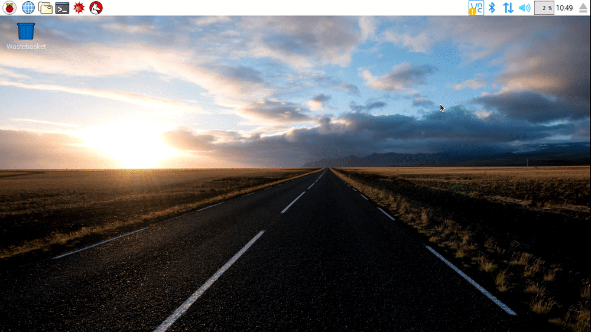

Υπάρχουν δύο τρόποι για να δημιουργήσεις καταλόγους στο Raspberry Pi. Ο πρώτος χρησιμοποιεί το γραφικό περιβάλλον επικοινωνίας - GUI και ο δεύτερος χρησιμοποιεί το τερματικό.

### Μέθοδος 1 - Χρήση του γραφικού περιβάλλοντος επικοινωνίας - GUI

- Άνοιξε ένα παράθυρο του διαχειριστή αρχείων κάνοντας κλικ στο εικονίδιο στην επάνω αριστερή γωνία της οθόνης

   

- Στο παράθυρο, κάνε δεξί κλικ και επιλέξε *Δημιουργία νέου...* και στη συνέχεια *Φάκελος* από το μενού περιβάλλοντος
- Στο παράθυρο διαλόγου, πληκτρολόγησε το όνομα του νέου σου καταλόγου και στη συνέχεια κάνε κλικ στο κουμπί *OK*

### Μέθοδος 2 - Χρήση του Τερματικού

- Άνοιξε ένα νέο παράθυρο του Τερματικού κάνοντας κλικ στο εικονίδιο στην επάνω αριστερή γωνία της οθόνης

   

- Δημιουργήσε έναν νέο κατάλογο χρησιμοποιώντας την εντολή mkdir ` `

    ~~~bash
    mkdir my-new-directory
    ~~~

- Μπορείς να εμφανίσεις σε λίστα τα περιεχόμενα του τρέχοντος καταλόγου χρησιμοποιώντας το `ls`
- Χρησιμοποιήσε την εντολή cd ` ` για να μπείς στο νέο σου κατάλογο

    ~~~bash
    mkdir my-new-directory
    ~~~

