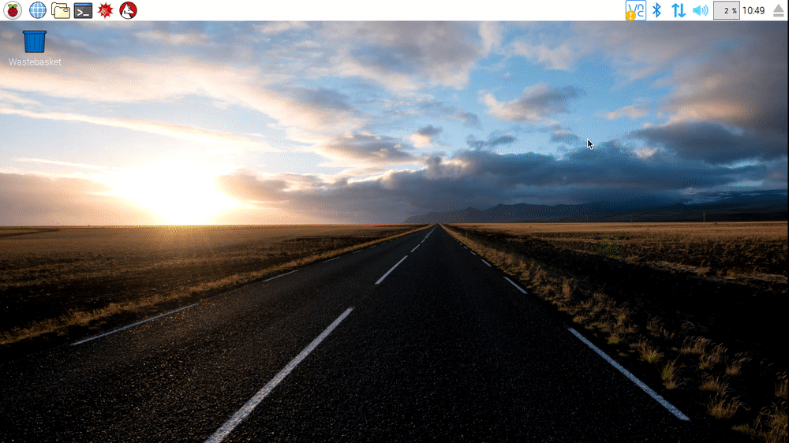

## Creating Directories on a Raspberry Pi

There are two ways to create directories on the Raspberry Pi. The first uses the GUI, and the second uses the Terminal.

### Method 1 - Using the GUI

- Open a File Manager window by clicking on the icon in the top left corner of the screen

   

- In the window, right-click and select *Create New...* and then *Folder* from the context menu
- In the dialogue box, type the name of your new directory and then click *OK*

### Method 2 - Using the Terminal

- Open a new Terminal window by clicking on the icon in the top left corner of the screen.

   

- You can create a new directory using the `mkdir` command

	~~~bash
	mkdir my-new-directory
	~~~

- You can list the contents of the current directory using `ls`
- To enter your new directory use the `cd` command

	~~~bash
	cd my-new-directory
	~~~

